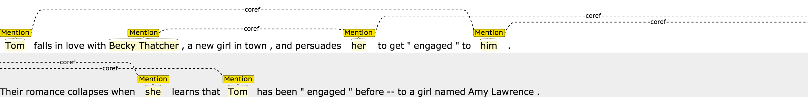
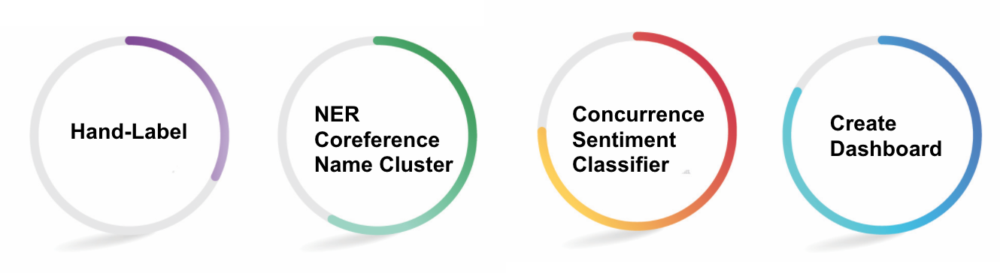
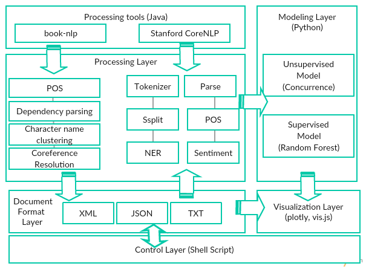
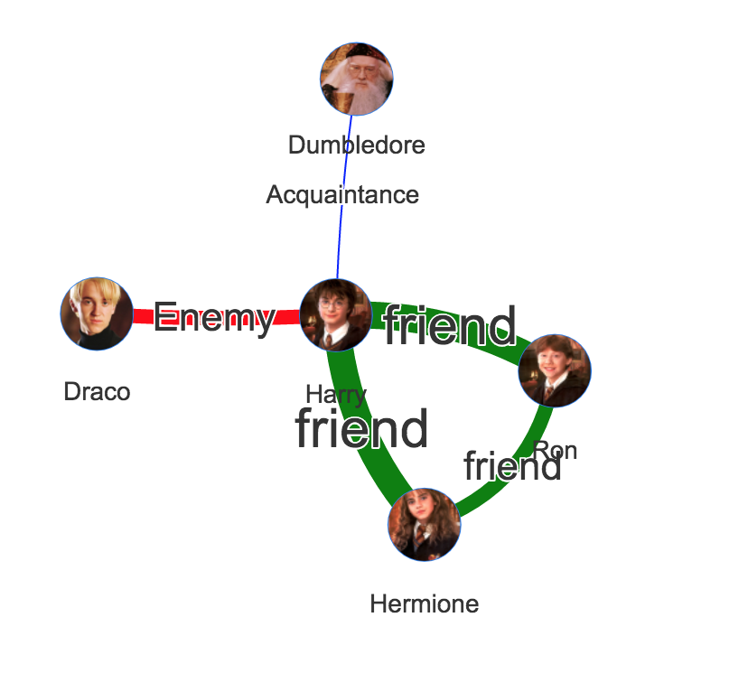

# CharacterGo

### Background

Identifying relationships between people is fundamental for the understanding of literatures. Main characters may have very certain strong relationship such as love, family, enemy, friend with others.

CharacterGo is a character interpretation system that be able to guide the interpretation of narrative events, explain character behaviors and steer the reader’s expectation about the plot using self-generated character relationship graphs. As such, it can have value for applications such as document summarization and machine reading.

### Name Clustering
- Name Entity Recognition
- Pronominal Reference Resolve

- Name Normalization/ Clustering    
  - "Tom", "Tom Sawyer", "Mr. Sawyer", "Thomas Sawyer" -> TOM_SAWYER

### Pipeline
1. Use book-nlp parse raw text to get tokenizers as well as name clusters
2. Load and parse html output from book-nlp in Python
3. Build supervised models including random forest, boosting, SVM and unsupervised representation using sklearn, plotly in Python
4. Wrap all the functionalities in Flask framework, and set up local host server to handle raw input and output predictions and visualizations.

### Results & Future Works

- Good performance (Accruacy 0.70) of character relationship extraction on plot summary
- Explore use more comprehensive NLP annotations in modeling (e.g. Action, noun chunks)
- Improve web app performance

